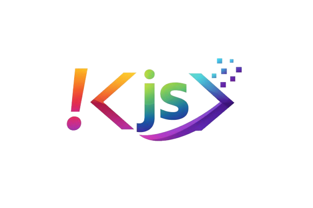
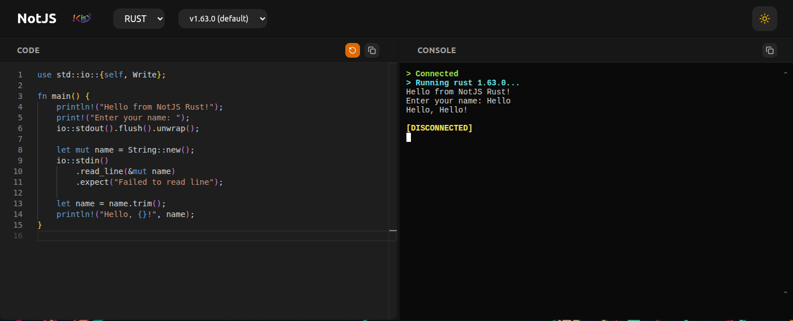
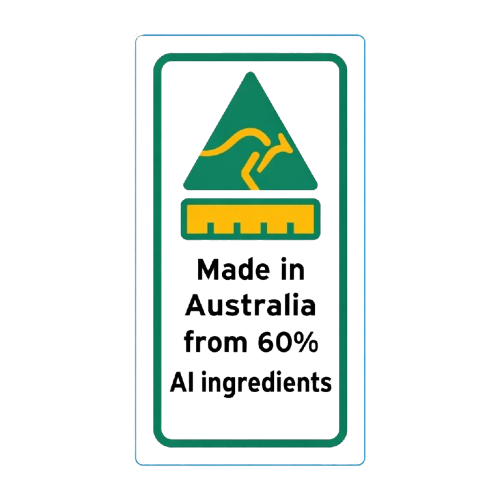
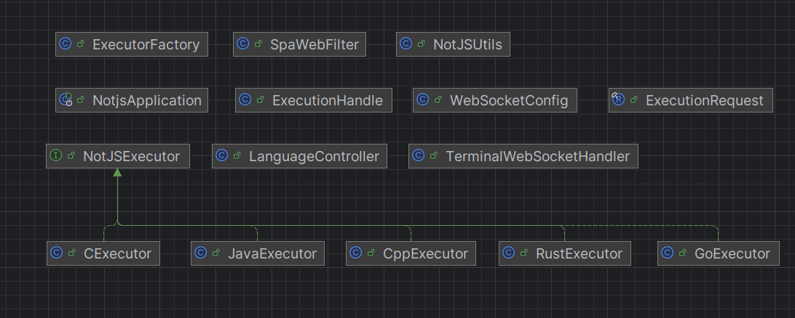

# NotJS

<p align="center">
  
</p>

NotJS is a backend (Spring Boot) and React library for code playgrounds for compiled languages.

**📦 For Blog Integration:** If you want to integrate NotJS code playgrounds into your blog or website, you'll need the React library:
```bash
npm install notjs-react
```
See below on instructions on how to deploy the Spring Boot server.

**NPM Package:** [notjs-react](https://www.npmjs.com/package/notjs-react)

NotJS is intended to be used mainly on blogs where you want to demo language features. I now use it on my [blog](https://chol.dev) to demo new Java features.

There are other platforms that do this, such as JDoodle and Replit. However, they have API limits which I wasn't happy with. I also wanted to use this as an opportunity to use Claude Code, and why not—it's fun reinventing the wheel sometimes.

<p align="center">
  
</p>

**[View Live Demo](https://notjs.chol.dev)**

## AI Disclosure & Security

<p align="center">
  
</p>

This project was developed with the help of Claude Code. The UI is my design but was mostly implemented by Claude and later tweaked.
The backend is Spring Boot and was also developed with the help of Claude. My main role was being the architect and using my judgment to reject or approve modifications.
I stepped in whenever I saw fit.

I recommend hosting this on a dedicated server without any critical services, such as a [Nanode 1 GB](https://www.linode.com/pricing/), which costs $5 USD per month.  

Yes, the logo is also AI generated. By ChatGPT.


## Architecture

The architecture is client-server, where a React client connects via HTTPS and WebSocket to execute code.
WebSocket allows us to get real-time output as the program executes.

**Spring Boot (API)**

<p align="center">
  
</p>

The Spring Boot backend is designed with extensibility in mind. There's an interface that can be implemented to add a new language or any other tool.
This relies on the strategy pattern. Spring's dependency injection makes it easy to get our list of executors, so we don't need to register them manually.
An executor map is maintained so when we receive the WebSocket payload, we choose the correct language executor.
"Executor" in this case isn't the same as the one used when talking about concurrency. It simply means the implementation of how a particular language is compiled and executed.

After each execution, any temporary files must be cleaned up, and that code lives in NotJSExecutor as a default method.

**React Library (Client)**

Without the React library, it's just a server. The React library can be used in MDX to allow integration of code playgrounds into your blog articles.
Please visit [notjs-react](https://www.npmjs.com/package/notjs-react).

## Local Development

To develop locally, you'll need Docker installed. This guide assumes you're on Linux or Mac.
Docker is used here and is recommended but not necessary. I recommend using the Docker approach.

### Prerequisites

- Docker (or Docker Desktop)
- Node.js 18+ and npm (for React library development)
- Java 21+ and Maven (for backend development without Docker)

### Building the Docker Image

The first step is to build the Docker image:

```bash
docker build -t notjs --build-arg NOTJSPROFILE=dev -f ./docker/Dockerfile .
```

When building for development, we use `NOTJSPROFILE=dev`, which points the NotJS component to the correct WebSocket and API endpoints.
In the `dev` case, this is localhost. If you wish to use your own domain, modify `packages/demo-app/src/App.tsx`:

```typescript
const API_CONFIG = {
    apiBaseUrl: isProd
        ? 'https://notjsapi.chol.dev/api'
        : 'http://localhost:8080/api',
    websocketUrl: isProd
        ? 'wss://notjsapi.chol.dev/terminal'
        : 'ws://localhost:8080/terminal'
}
```

### Running the Docker Image

```bash
docker run -p 8080:8080 --rm notjs
```

Now you can run the image, and the NotJS demo will be running at http://localhost:8080.

### Developing the React Library

To develop the `notjs-react` library:

1. Navigate to the React library directory:
```bash
cd packages/notjs-react
```

2. Install dependencies:
```bash
npm install
```

3. Build the library in watch mode:
```bash
npm run dev
```

4. In another terminal, link the library locally:
```bash
npm link
```

5. Navigate to the demo app and link the library:
```bash
cd ../demo-app
npm link notjs-react
npm run dev
```

The demo app will hot-reload when you make changes to the library.

### Developing the Backend

To run the Spring Boot backend without Docker:

1. Ensure Java 21+ and Maven are installed

2. Build the project:
```bash
mvn clean package -DskipTests
```

3. Run the backend:
```bash
mvn spring-boot:run -Dspring-boot.run.profiles=dev
```

The API will be available at http://localhost:8080/api 

## Deployment

I've deployed this using Nginx and Docker Compose. Nginx acts as the reverse proxy.

First, clone the repository and run Docker Compose:

```bash
git clone https://github.com/cholnhial/notjs
cd notjs
docker compose up --build -d
```

That's it! The application will be running with Nginx handling HTTPS and proxying requests to the Spring Boot backend.

For production deployment, I recommend:
- A dedicated VPS (e.g., [Linode Nanode 1 GB](https://www.linode.com/pricing/) at $5/month)
- Setting up SSL certificates with Let's Encrypt
- Configuring proper firewall rules
- Regular backups of your server

## Supported Languages

NotJS currently supports the following compiled languages:

- **Java** (versions 8, 11, 17, 21, 25)
- **C** (C89, C99, C11, C17, C23)
- **C++** (C++98, C++11, C++14, C++17, C++20, C++23)
- **Go** (version 1.19.8)
- **Rust** (version 1.63.0)

## License

MIT

## Contributing

Contributions are welcome! Please feel free to submit a Pull Request.